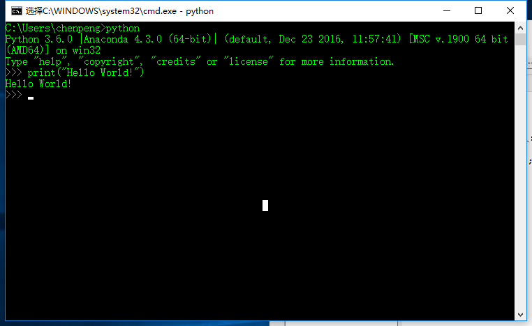
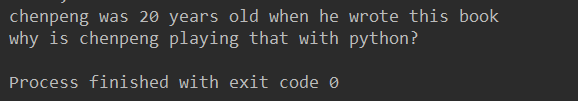
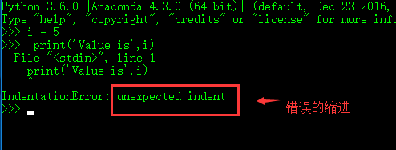
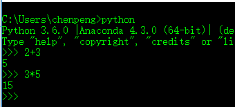

***文本为《python简易教程》的自学笔记***

#    第一步

###    使用解释提示符
在Python命令解释提示符输入：
            
```python
print("Hello World!");
```

结果



### 如何退出解释器提示符
>    GNU/LINUX 或者 OS X上的shell程序，`ctrl+d' 或者输入 `exit()`

>    WINDOWS: `ctrl+z [enter]` 退出

### 使用编辑器

这里使用了pycharm


#    基础

### 注释
例子：

        
```python
print('Hello world') # print is a function
```
        
### 字面常量

>    字面常量的例子是诸如23 4 这样的数字或者`这是一个文本` 这样的文本

### 数字

>    数字主要分两种
>    *    整数(Integers)
>    *    浮点数(Floats)

### 字符串

>字符串(string) 是字符(characters)的序列(sequence)
>    *    单引号,可以使用单引号来指定字符串,比如说`'天行所向利剑凌空'`
>    *    双引号,被双引号和单引号括起来的字符串其工作机制是一样的,比如说`"what's your name?`
>    *    三引号,在三引号之间的实际上是多行字符串，另外可以再三引号之间自由地使用单引号和双引号        

### 字符串是不可变的

这意味着一旦你创建了一串字符串，你就不能改变他

### 格式化方法 

有时候，我们想从其他信息中构建字符串。利用formate函数

```python
age = 20
name = 'chenpeng'
print('{0}' was {1} years old when he wrote this book.'.format(name,age))
print('why is {0} playing with that python?'.format(name))
```

运行结果：



但是，数字是可选的，同样的也可以写成

```python
print('{} was {} years old when he wrote this book'.format(name,age))
print('why is {} playing that with python?'.format(name))
```

formate 还有更详细的用法：

```python
        # 对于浮点数，'0.333' 保留小数点(.)后三位
        print('{0:.3f}'.format(1.0/3));
        # 使用下划线填充文本，并保持文字处于中间位置
        # 使用(^)定义'___hello___'字符串长度为11
        print('{0:_^11}'.format('hello'))
        #基于关键词输出'Swaroop wrote A Byte of Python
        print('{name} wrote {book}'.format(name="xiaopeng",book="enjoy-python"))
```
        
注意print()函数，最后会以一个不可见的"新一行"字符(\n)结尾,为了防止打印过程中出现
换行,可以通过`end`指定空白结尾:

```python
        print('a',end='')
        print('b',end='')
```
        
输出结果:

        ab
        
或者你可以通过end指定空格结尾:

```python
        print('a',end=' ')
        print('b',end=' ')
        print('c')
```
        
输出结果:

        a b c

###    转义序列(Escape Sequence)

如果希望生成的字符串中包含(')、(\)以及其他诸如控制字符串格式的(\n)、(\t)等需要用到转义序列

比如要输出`what's your name` 

应该这样写 `'what\'s your name'`

利用`\n`换行,`This is the first line \n This is the second line'`

还有一个特殊的用法，用在末尾表示字符串在下一行继续:

```python
        "This is the first sentence.\
        This is the second sentence."
```

相当于:

```python
        "This is the first sentence.This is the second sentence."
```
     
###    原始字符串

如果你需要指定一些未经处理的字符串,比如转义序列,可以在字符串前加上`r`或者`R`

```python
        r"Newlines are indicated by \n"
```
        
###    变量

使用字面量无法满足我们开发的需求， 这时候就需要使用变量(veriables).

###    标识符命名

*    第一个字符必须是字母表中的字母(大小写ASCII或者Unicode或者_)
*    标识符的其他部分可由字符、下划线、数字组成
*    标识符区分大小写

###    数据类型

变量可以将各种形式的值保存为不同的数据类型,基本的数据类型包括数字和字符串，在后面我们将会讨论通过类(Classes)来创建我们自己的数据类型.

###    对象


需要记住python将程序中任何内容统称为对象(Object).这是一般意义的叫法。我们通常以某对象(object)相称，而非某东西(something)
 
###     如何编写python程序

案例：使用变量和字面变量
 
```python
# 文件名:var.py

i = 5
print(i)
i = i+1
print(i)

s = '''This is muti-line string.
This is the second line.'''
print(s)
```

输出：

        5
        6
        This is muti-line string.
        This is the second line.
        
>    变量秩序被赋值某一个值，不需要声明或定义数据类型

###    物理行与逻辑行

物理行(Physical Line)是指在编写程序时你所看到的内容。
逻辑行(Logical Line)是指Python所识别的单个语句。
实际上，python暗含这样一个期望鼓励每一行使用一句独立的语句从而使得代码更加可读
如果你希望在一行物理行中指定多行逻辑行，那么你必须使用`;`来表示该行或者语句的结束.

```python
i = 5
print(i)
```
实际上等价于
```python
i = 5;
print(i);
```
同样可以看作
```python
i = 5;print(i);
```
也与这一写法相同
```python
i = 5;print(i)
```
> 实际上不应该使用分号，在python程序中大多不存在`;`的使用，如果你有一行非常长的代码，你可以通过反斜杠`\`来将其拆分成多个物理行.这被称之为**显式连接**(Explicit Line Joining):

```python
s = 'This is a string.\
This continues the string.'
print(s)
```
结果输出：

        This is a stirng.This continues the string.
        
类似地，

```python
i = \
5
```
等价于
```python
i = 5
```

>    在某些情况下，会存在一个隐含的交涉，允许你不用反斜杠这一情况即以括号开始，它可以是方括号或者花括号，但不能是结束括号，这称为**隐式连接**(Implicit Line Joining)


### 缩进

空白区在python中是非常重要的。空白区在各行的靠头非常重要被称为(Indentation).在逻辑行的开头留下空白区(使用空格或者制表符)用以确定各逻辑行的缩进级别，后者可以确定语句的分组。这表示放置在一起的语句必须要有相同的缩进，我们把每一组这样的语句称为**块**(block)

错误的缩进会导致错误

```python
i = 5
 print('Value is',i)
print('I repeat,the value is',i)
```



>如何缩进?

>使用四个空格来缩进，这是python官方的建议


#    运算符与表达式


我们所编写的大多数语句(逻辑行)都包含了表达式(Expressions).
一个表达式的简单的例子就是`2+3`.表达式，可以拆分为
*    运算符(Operators)
*    操作数(Operands)

在`2+3`这样的表达式里，`+`就是运算符，`2`和`3`就是操作数

###    运算符

下面来简要的了解各类运算符以及他们的用法



下面是运算符的速览

*    `+` （加）
        *    两个对象相加
        *    `3+5`则输出`8`，`'a'+'b'` 输出 `'ab'` 

        
*    `-` （减）
        *    从一个数中减去另一个数,如果第一个操作数不存在，假定为0
        *    `-5.2` 将输出一个负数
 
       
*    `*` （乘）
        *    给出两个数的乘积，或者返回字符串重复指定次数后的结果
        *    `2*3` 输出 `6` . `'la'*3` 输出 `'lalala'`.
    
    
*    `**`（乘方）
        *    返回x的y次方
        *     `3**4` 输出 `81` （即`3*3*3*3`）
     
   
*    `/` （除）
        *    x除以y
        *    `13/3` 输出 `4.333333333333`


*    `//` （整除）
        *    x除以y并对结果向下取整至最接近的整数
        *     `13//4` 输出 `4`.
        *     `-13//4` 输出 `-5`
       

*    `%` （取模）
        *    返回除法之后的余数
        *     `13%5` 输出 `1` 


*    `<<` （左移）
        *    将数字的位想左移动指定的位数
        *     `2<<2` 输出 `8` 


*    `>>` （右移）
        *    将数字的位向右移动指定的位数
        *     `11>>1` 输出 `5`


*    `&` （按位与）
        *    对数字进行按位与操作
        *     `5&3` 输出 `1`


*    `|` （按位或）
        *    对数字进行按位或操作
        *     `5|3` 输出 7


*    `~` （按位取反）
        *    `~5` 输出 -6 
        *     x的取反的结果为 `-(x+1)`


*    `<` （小于）
        *    返回x是否小于y，所有比较的结果返回`True`或者`False`，注意首字母为大写
        *  `5<3` 输出 `False`
        *  比较可以任意组成链接:`3<5<7` 返回 `True`


*    `<=` （小于等于）
        *    返回x是否小于或等于y
        *     `x = 3;y = 6;x<=y` 返回 `True`


*    `>=` （大于等于）
        *    返回x是否大于或者等于y
        *    `x = 4;y = 3;x>=3` 返回 `True`


*    `==` （等于）
        *    比较两个对象是否相等
        *    `x = 2;y = 2;x == y` 返回 `True`
        *    `x = 'str';y = 'stR';x == y` 返回 `False`
        *     `x = 'str';y = 'str';x == y` 返回 `True`


*    `!=` （不等于）
        *    比较两个对象是否不相等
        *     `x = 2;y = 3;x!=y` 返回 `True`


*    `not` （布尔"非"）
        *    如果x是`True`,返回 `False`，同理反之亦如是
        *    `x = True;not x` 返回 `False`


*    `and` （布尔"与"）
        *    若x为`False`,则` x and y `返回 `False`,否则返回`y`的计算值
        *    若x为`False`,` x = False;y = True; x and y `此时python将不会计算y因为它已经了解and表达式的左侧为`False`，意味着整个表达式都是`False`,这种情况为**短路运算**(Short-circuit Evaluation)


*    `or` （布尔"或"）
        *    如果x为` True `,返回 ` True `，否则返回y的计算值
        *     ` x = True;y = False; x or y ` 返回` True `,在这里短路运算同样适用.
   
        


 