***文本为《python简易教程》的自学笔记***


#   **第一步**

---
###    **使用解释提示符**
在Python命令解释提示符输入：
            
```python
print("Hello World!");
```

结果


---

### **如何退出解释器提示符**
>    GNU/LINUX 或者 OS X上的shell程序，`ctrl+d' 或者输入 `exit()`

>    WINDOWS: `ctrl+z [enter]` 退出

---
### **使用编辑器**

这里使用了pycharm


---
#    **基础**

---
### **注释**
例子：

        
```python
print('Hello world') # print is a function
```
   
---     
### **字面常量**

>    字面常量的例子是诸如23 4 这样的数字或者`这是一个文本` 这样的文本

---
### **数字**

>    数字主要分两种
>    *    整数(Integers)
>    *    浮点数(Floats)

---
### **字符串**

>字符串(string) 是字符(characters)的序列(sequence)
>    *    单引号,可以使用单引号来指定字符串,比如说`'天行所向利剑凌空'`
>    *    双引号,被双引号和单引号括起来的字符串其工作机制是一样的,比如说`"what's your name?`
>    *    三引号,在三引号之间的实际上是多行字符串，另外可以再三引号之间自由地使用单引号和双引号        

---
### **字符串是不可变的**

这意味着一旦你创建了一串字符串，你就不能改变他

---
###  **格式化方法**

有时候，我们想从其他信息中构建字符串。利用formate函数

```python
age = 20
name = 'chenpeng'
print('{0}' was {1} years old when he wrote this book.'.format(name,age))
print('why is {0} playing with that python?'.format(name))
```

运行结果：


但是，数字是可选的，同样的也可以写成

```python
print('{} was {} years old when he wrote this book'.format(name,age))
print('why is {} playing that with python?'.format(name))
```

formate 还有更详细的用法：

```python
        # 对于浮点数，'0.333' 保留小数点(.)后三位
        print('{0:.3f}'.format(1.0/3));
        # 使用下划线填充文本，并保持文字处于中间位置
        # 使用(^)定义'___hello___'字符串长度为11
        print('{0:_^11}'.format('hello'))
        #基于关键词输出'Swaroop wrote A Byte of Python
        print('{name} wrote {book}'.format(name="xiaopeng",book="enjoy-python"))
```
        
注意print()函数，最后会以一个不可见的"新一行"字符(\n)结尾,为了防止打印过程中出现
换行,可以通过`end`指定空白结尾:

```python
        print('a',end='')
        print('b',end='')
```
        
输出结果:

        ab
        
或者你可以通过end指定空格结尾:

```python
        print('a',end=' ')
        print('b',end=' ')
        print('c')
```
        
输出结果:

        a b c

---
###    **转义序列(Escape Sequence)**

如果希望生成的字符串中包含(')、(\)以及其他诸如控制字符串格式的(\n)、(\t)等需要用到转义序列

比如要输出`what's your name` 

应该这样写 `'what\'s your name'`

利用`\n`换行,`This is the first line \n This is the second line'`

还有一个特殊的用法，用在末尾表示字符串在下一行继续:

```python
        "This is the first sentence.\
        This is the second sentence."
```

相当于:

```python
        "This is the first sentence.This is the second sentence."
```
     
---
###    **原始字符串**

如果你需要指定一些未经处理的字符串,比如转义序列,可以在字符串前加上`r`或者`R`

```python
        r"Newlines are indicated by \n"
```

---      
###    **变量**

使用字面量无法满足我们开发的需求， 这时候就需要使用变量(veriables).

---
###    **标识符命名**

*    第一个字符必须是字母表中的字母(大小写ASCII或者Unicode或者_)
*    标识符的其他部分可由字符、下划线、数字组成
*    标识符区分大小写

---
###    **数据类型**

变量可以将各种形式的值保存为不同的数据类型,基本的数据类型包括数字和字符串，在后面我们将会讨论通过类(Classes)来创建我们自己的数据类型.

---
###    **对象**

需要记住python将程序中任何内容统称为对象(Object).这是一般意义的叫法。我们通常以某对象(object)相称，而非某东西(something)

---
###     **如何编写python程序**

案例：使用变量和字面变量
 
```python
# 文件名:var.py

i = 5
print(i)
i = i+1
print(i)

s = '''This is muti-line string.
This is the second line.'''
print(s)
```

输出：

        5
        6
        This is muti-line string.
        This is the second line.
        
>    变量秩序被赋值某一个值，不需要声明或定义数据类型


---

###    **物理行与逻辑行**

物理行(Physical Line)是指在编写程序时你所看到的内容。
逻辑行(Logical Line)是指Python所识别的单个语句。
实际上，python暗含这样一个期望鼓励每一行使用一句独立的语句从而使得代码更加可读
如果你希望在一行物理行中指定多行逻辑行，那么你必须使用`;`来表示该行或者语句的结束.

```python
i = 5
print(i)
```
实际上等价于
```python
i = 5;
print(i);
```
同样可以看作
```python
i = 5;print(i);
```
也与这一写法相同
```python
i = 5;print(i)
```
> 实际上不应该使用分号，在python程序中大多不存在`;`的使用，如果你有一行非常长的代码，你可以通过反斜杠`\`来将其拆分成多个物理行.这被称之为**显式连接**(Explicit Line Joining):

```python
s = 'This is a string.\
This continues the string.'
print(s)
```
结果输出：

        This is a stirng.This continues the string.
        
类似地，

```python
i = \
5
```
等价于
```python
i = 5
```

>    在某些情况下，会存在一个隐含的交涉，允许你不用反斜杠这一情况即以括号开始，它可以是方括号或者花括号，但不能是结束括号，这称为**隐式连接**(Implicit Line Joining)

---
### **缩进**

空白区在python中是非常重要的。空白区在各行的靠头非常重要被称为(Indentation).在逻辑行的开头留下空白区(使用空格或者制表符)用以确定各逻辑行的缩进级别，后者可以确定语句的分组。这表示放置在一起的语句必须要有相同的缩进，我们把每一组这样的语句称为**块**(block)

错误的缩进会导致错误

```python
i = 5
 print('Value is',i)
print('I repeat,the value is',i)
```


>如何缩进?

>使用四个空格来缩进，这是python官方的建议


---
#    **运算符与表达式**


我们所编写的大多数语句(逻辑行)都包含了表达式(Expressions).
一个表达式的简单的例子就是`2+3`.表达式，可以拆分为
*    运算符(Operators)
*    操作数(Operands)

在`2+3`这样的表达式里，`+`就是运算符，`2`和`3`就是操作数

---
###    **运算符**

下面来简要的了解各类运算符以及他们的用法


下面是运算符的速览

*    `+` （加）
        *    两个对象相加
        *    `3+5`则输出`8`，`'a'+'b'` 输出 `'ab'` 

        
*    `-` （减）
        *    从一个数中减去另一个数,如果第一个操作数不存在，假定为0
        *    `-5.2` 将输出一个负数
 
       
*    `*` （乘）
        *    给出两个数的乘积，或者返回字符串重复指定次数后的结果
        *    `2*3` 输出 `6` . `'la'*3` 输出 `'lalala'`.
    
    
*    `**`（乘方）
        *    返回x的y次方
        *    `3**4` 输出 `81` （即`3*3*3*3`）
     
   
*    `/` （除）
        *    x除以y
        *    `13/3` 输出 `4.333333333333`


*    `//` （整除）
        *    x除以y并对结果向下取整至最接近的整数
        *    `13//4` 输出 `4`.
        *    `-13//4` 输出 `-5`
       

*    `%` （取模）
        *    返回除法之后的余数
        *    `13%5` 输出 `1` 


*    `<<` （左移）
        *    将数字的位想左移动指定的位数
        *    `2<<2` 输出 `8` 


*    `>>` （右移）
        *    将数字的位向右移动指定的位数
        *    `11>>1` 输出 `5`


*    `&` （按位与）
        *    对数字进行按位与操作
        *    `5&3` 输出 `1`


*    `|` （按位或）
        *    对数字进行按位或操作
        *    `5|3` 输出 7


*    `~` （按位取反）
        *    `~5` 输出 -6 
        *    x的取反的结果为 `-(x+1)`


*    `<` （小于）
        *    返回x是否小于y，所有比较的结果返回`True`或者`False`，注意首字母为大写
        *  `5<3` 输出 `False`
        *  比较可以任意组成链接:`3<5<7` 返回 `True`


*    `<=` （小于等于）
        *    返回x是否小于或等于y
        *    `x = 3;y = 6;x<=y` 返回 `True`


*    `>=` （大于等于）
        *    返回x是否大于或者等于y
        *    `x = 4;y = 3;x>=3` 返回 `True`


*    `==` （等于）
        *    比较两个对象是否相等
        *    `x = 2;y = 2;x == y` 返回 `True`
        *    `x = 'str';y = 'stR';x == y` 返回 `False`
        *    `x = 'str';y = 'str';x == y` 返回 `True`


*    `!=` （不等于）
        *    比较两个对象是否不相等
        *    `x = 2;y = 3;x!=y` 返回 `True`


*    `not` （布尔"非"）
        *    如果x是`True`,返回 `False`，同理反之亦如是
        *    `x = True;not x` 返回 `False`


*    `and` （布尔"与"）
        *    若x为`False`,则` x and y `返回 `False`,否则返回`y`的计算值
        *    若x为`False`,` x = False;y = True; x and y `此时python将不会计算y因为它已经了解and表达式的左侧为`False`，意味着整个表达式都是`False`,这种情况为**短路运算**(Short-circuit Evaluation)


*    `or` （布尔"或"）
        *    如果x为` True `,返回 ` True `，否则返回y的计算值
        *    ` x = True;y = False; x or y ` 返回` True `,在这里短路运算同样适用.
   
---
### **数值运算与赋值的快捷方式**

> 变量 = 变量 运算 表达式 

``` python
a = 2
a = a*3
```

> 变量 运算 = 表达式 

```python
a = 2
a *= 3
```
---
### **求值顺序**

下表罗列了python的运算的优先级

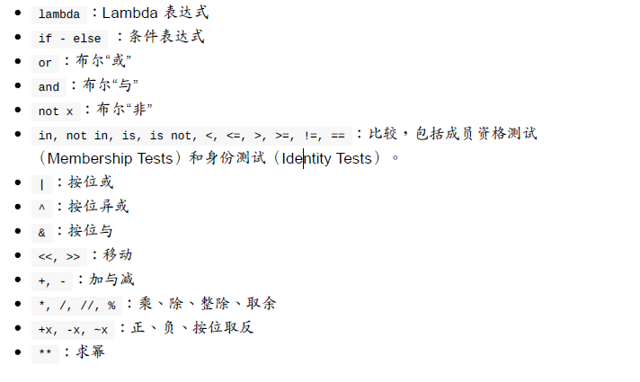
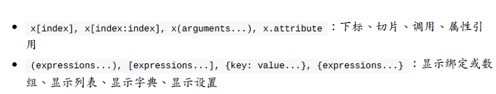

---    
### **改变运算顺序**

可以使用括号来使得表达式更加易读

---
### **结合性**

运算符通常由左至右结合

---
### **表达式**

例子

```python
length = 5
breadth = 2

area = length*breadth
print('Area is ',area)
print('Perimeter is ',2*(length+breadth))
```

输出

  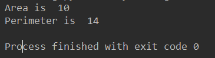
  


---
#    **控制流**

python中有三种控制流语句
*    if
*    for
*    while

---
### **if语句**

案例，其中else从句是可选的

```python
number = 23
guess = int(input('Enter an integer:'))

if guess == number:
    print('Congratulations,gu guessed it.')
    print('(but you do not win any prizes!)')
elif guess<number:
    print("No,it is a litter higher than that")
else:
    print('No,it is a little lower than that!')

print('Done')
```

输出

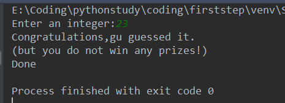
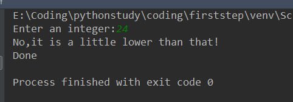


> python 中不存在switch语句

---
### **while 语句**

案例：

```python
number = 23
running = True

while running:
    guess = int(input('enter an integer :'))

    if guess == number:
        print('success!,you guessed it.')
        running = False
    elif guess<number:
        print('No,it is little higher!')
    else:
        print('No,it is little lower!')
else:
    print('The while loop is over.')

print('done')
```

结果：

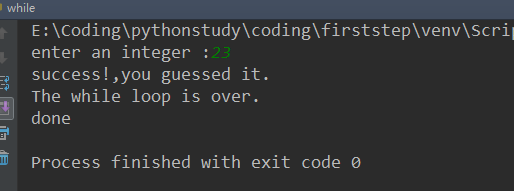

> 可以在while循环中使用else语句

---
### **for 循环**

```python
for i in range(1,5):
    print(i)
else:
    print('The for loop is over')

```
输出的结果为

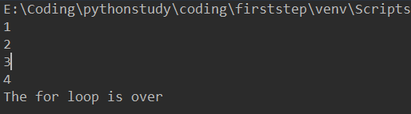

>在这个例子中我们使用了内置的`range`函数生成这一数字序列。range(1,5)将会产生[1,2,3,4]。如果我们向range提供第三个参数，这个数字将成为步长，比如range(1,5,2),将会产生[1,3],特别注意不包括第二个数字在内，换做数学语言来讲是左边开区间，右边闭区间，第三个数为步长。

---

### **break 语句**


`break`语句用以中断循环语句，也就是终止循环的语句。

> 有一点需要注意的是，如果你中断了比如for和while循环，那么，任何相应循环中的else块都将不会执行

案例：

```python
while True:
    s = input('Enter something:')
    if s == 'quit':
        break
    print('Length of the string is ',len(s))
print('Done')
```
运行结果：


---
###  **continue 语句**

所谓continue就是告诉python跳过当前循环中的剩余的语句继续下一个循环。

案例：

```python
while True:
    s = input('Enter something:')
    if s == 'quit':
        break
    if len(s)<3:
        print('Too small')
        continue
    print('Input is out of sufficient length')
```

运行结果：

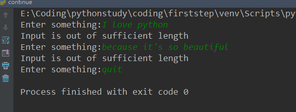

> 注意 continue 同样能够适用于for循环


---

#    **函数**

所谓函数(Functions)就是可重复使用的程序片段。
通过函数名在程序的任何地方来运行代码块，并且可以执行任意次数，这就是所谓的调用(Calling)函数

函数可以通过`def` 来定义
> 函数定义形式:

        def say_hello():
            # do something...
        # end function
>函数的调用:  

        say_hello() 
        

---

### **函数参数**

函数中的参数通过防止在用以定义函数的一对括号中指定。

特别地：

**在定义函数时候给的名称叫做"形参"(Parameters)**

**在调用函数时所提供给函数的值称为"实参"(Arguments)**

案例：

```python
def print_max(a,b):
    if a>b:
        print(a,'is maximum')
    elif a == b:
        print(a,'is equal to',b)
    else:
        print(b,'is maximum')


print_max(3,4)

x = 5
y = 7

print_max(x,y)
```

运行结果：

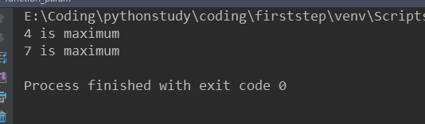

> 第一次调用我们以实参的形式直接向函数提供这一数字，第二次调用时候，我们使用变量来作为实参调用函数，是的将实参x赋值给形参a，两次print_max都以相同的方式工作

---
### **局部变量**

> 当你在一个函数的定义中声明变量，他们不会以任何方式与身处函数之外具有相同名称的变量产生任何的关系，也就是说，这些变量名，**只存在函数这一局部(local)**.这被称之为**作用域(Scope)**.

案例:

```python
x = 50

def func(x):
    print('x is ',x)
    x = 2
    print('Changed local x to ',x)

func(x)
print('x is still ',x)
```

结果：

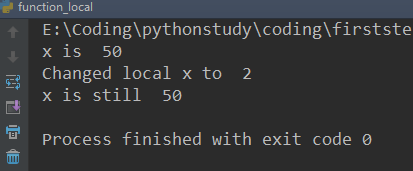

> 实际上x的值并不会收到调用的函数中的局部变量的影响.

---
### **`global` 语句**


如果你想给一个在程序顶层的变量赋值，你必须告诉python这是一个全局(Global)的变量不是局部变量,我们通常需要通过global语句来完成这件事情.因为，你不看为一个定义于函数之外的变量赋值.

案例：

```python
x = 50

def func():
    global x

    print('x is ',x)
    x = 2
    print('changed global x to ',x)

func()
print('value of x is ',x)
```

运行结果：

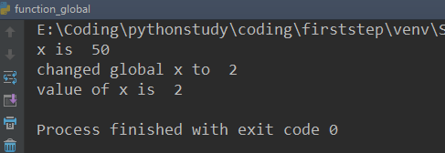

> 不难看出和上一个例子不同这里的x已经改变了,如果语句中不知一个全局变量，你可以这样写 `global x,y,z`


---
###   **默认参数值**

对于有些函数你可能希望是一些参数可选并使用默认值，你可以在函数定义时候，附加一个赋值运算符(`=`)来为参数制定默认的参数值.

案例:

```python
def say(message,times=1):
    print(message*times)

say('Hello')
say('World',5)
```

运行结果：

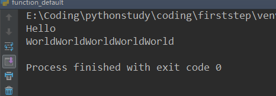

> 注意！
> 在函数列表中，拥有默认参数值参数不能位于没有默认参数值的参数之前.
> 举例来说,def func(a,b = 5)是合法的，但def func(a = 5,b)是无效的

---
### **关键字参数**

假设你有一些许多参数的函数，但是，你不可能为每一个参数都赋值，这样看起来很傻，我们只希望对其中某些关键的参数来给这些参数赋值，这就是**关键字参数(*Keywrod Arguments*)**

案例：

```python
def func(a,b = 5,c =10):
    print('a is ',a,' and b is ',b,'and c is ',c)

func(3,7)
func(25,c = 24)
func(c = 50,a = 100)
```

运行结果：


> 实际上可以看到func(3,7),参数a获得了3，参数b获得7，而c获得了函数定义时候的默认值
>第二次调用，参数a获得25，但是这时候我们不想给b赋值，我们通过关键字参数来直接给c赋值，从而打破了函数调用时参数顺序的限定
>同理第三次调用，我们直接将c先赋值，再对a赋值，这也是允许的，所以python的语法还是很灵活的!记住这是**关键字参数**带给我们的便利

---
### **可变参数**

有时你可能想定义的函数里面能够有任意数量的变量，也就是参数数量是可变的，这可以通过使用型号来实现

案例：

```python
def total(a = 5,*numbers,**phonebook):
    print('a',a)

    for single_item in numbers:
        print('single_item',single_item)

    for first_part,second_part in phonebook.items():
        print(first_part,second_part)

print(total(10,1,2,3,Jack = 1123,John = 2231,Inge=1560))
```

结果：

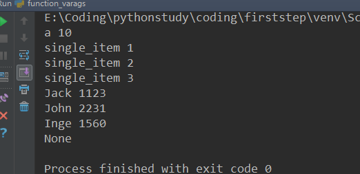

> 当我们声明\*param的星号参数时，从此处开始知道结束的所有位置参数(*Positional Arguments*)都将被收集并汇集成一个称为"param"的**元组(*Tuple*)**

> 当我们声明\*\*param的双星号参数时,从此处来时直至结束的所有的关键字参数都将被收集并汇集成一个名为Param的**字典(*Dictionary*)**

---
###     **`return` 语句**

`return` 语句用于从函数中返回，也就是中断函数.

案例：

```python
def maximum(x,y):
    if x>y:
        return x
    elif x == y:
        return "The numbers are equal "
    else:
        return y

print(maximum(2,3))
```

运行结果：

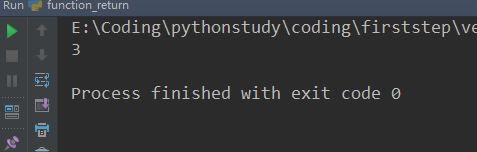

> 要注意如果return 没有搭配任何一个值则代表着 None.
None 在Pyton中是一个特殊的类型，代表着虚无。
每一个函数都在其末尾隐含了一句`return None`,除非你写了你自己的`return` 语句.

> 另外有一个名为max内置函数已经实现了找最大值的功能，尽可能使用这一内置函数


---
###    **DocStrings**

***DocStrings***是一款甚是有没的功能，能够帮助你更好地记录程序并让其更加易于理解。

案例：

```python
def print_max(x,y):
    '''prints the maximum of tow mumbers.
    The tow values must be integers.'''

    x = int(x)
    y = int(y)

    if x>y:
        print(x,' is maximum')
    else:
        print(y,' is maximum')

print_max(3,5)
print(print_max.__doc__)
```

结果：

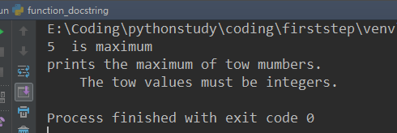

>我们可以通过函数的 `__doc__` 的属性来获取函数print_max文档的字符串属性，自动化工具可以用这种方式来检索你程序中的文档，所以墙裂建议编写的所有重要的函数配以文档字符串。python发型版本中附带的pydoc命令和help()使用文旦字符串的方式类似


 